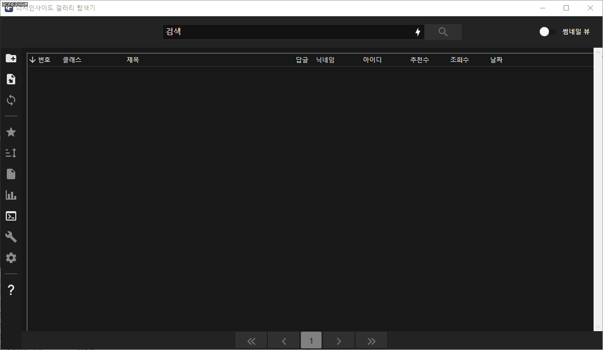
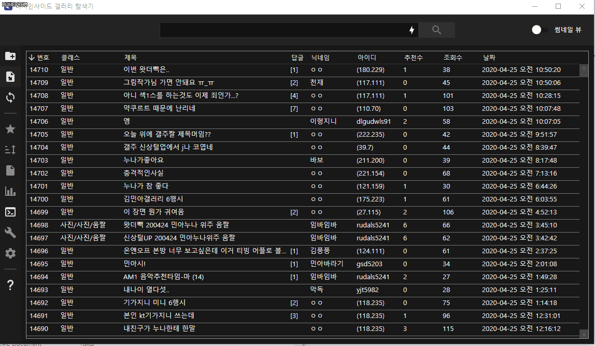

# Gallery Explorer






Crawls the posts and Reconstructs them in a new form.

## Image Similarity Analyzer and Cluster

This program includes an image similarity analyzer and clustering tools.
You can use easily these tools.

## Archive for Detail Search

If you want to use detail searching such as contents or comment body, or statistics,
you can use your own build of my `gall-archive` project.
Please refer to the following steps.

### Build your own archive

```
1. Make data file using GalleryExplorer
2. Modify DCGalleryAnalyzer.Instance.Open file name of Main method of gall-archive project to your data file.
3. Set your own mininum number of archive target no.
4. Run gall-archive executable until program finish.
5. Then crawling data files are created on sub-directory of Archive/*.
6. Modify gall-archive-zip like gall-archive
7. Run gall-archive-zip executable on gall-archive binary runned.
8. After finishing of gall-archive-zip, run DCInsideArchiveIndex.Build and DCInsideArchiveIndexDatabase.Build methods.
9. Rename archive.db as XXGall.db, article-index-ii.json as XXGall-ai.json, and comment-index-ii.json as XXGall-ci.json
10. Everything is done, finally you can use your own archive feature.
```

### How to run this?

The archive tool converts all the words to english alphabet and then creates an index tree using trie.
The index processing is incredibly fast because the trie struct is used in-memory.
This works similar to Elasticsearch. 

## Supports

```
DCInside
Huv.kr - will be supports
Clien - will be supports
FM Korea - will be supports
Inven - will be supports
```
